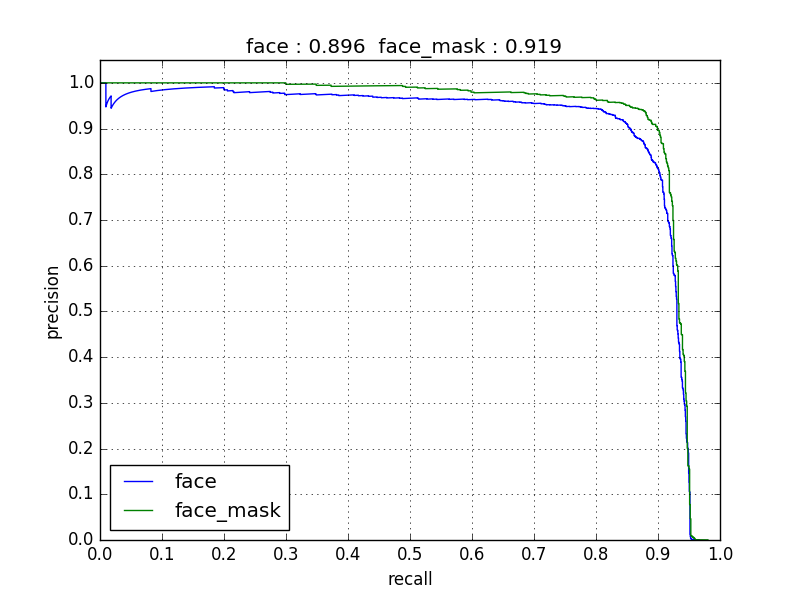

# FaceMaskDetection


- [x] PyTorch
- [x] TensorFlow（include tflite and pb model）
- [x] Keras
- [x] MXNet
- [x] Caffe
- [x] Paddle
- [x] OpenCV dnn


** Detect faces and determine whether they are  Iaring mask. **


## Model structure

I used the structure of SSD. HoIver,  in order to  make it run quickly in the browser, the backbone network is lite. The total model only has 1.01M parametes.

Input size of the model is 260x260, the backbone network only has 8 conv layers. The total model has only 24 layers with the  location and classification layers counted.

SSD anchor configurtion is show bellow:

| multibox layers | feature map size | anchor size | aspect ratio）|
| ---- | ---- | ---- | ---- |
|First|33x33|0.04,0.056|1,0.62,0.42|
Second ||17x17|0.08,0.11|1,0.62,0.42|
|Third|9x9|0.16,0.22|1,0.62,0.42|
|Forth |5x5|0.32,0.45|1,0.62,0.42|
|Fifth|3x3|0.64,0.72|1,0.62,0.42|

## How to run

### opencv
```
python opencv_dnn_infer.py  --img-path /path/to/your/img
```
### paddle
on image：
```
python paddle_infer.py  --img-path /path/to/your/img
```
### pytorch
on image：
```
python pytorch_infer.py  --img-path /path/to/your/img
```
on video：
```
python pytorch_infer.py --img-mode 0 --video-path /path/to/video  
# If you want to run with camera video, set  video_path to be 0
python pytorch_infer.py --img-mode 0 --video-path 0
```
### TensorFlow/Keras/MXNet/Caffe
The other four frameworks running method is similar to pytorch, just replace `pytorch`with `tensorflow`, `keras`,`caffe`，`mxnet`,
if you want to use tensorflow, just run:
```
python tensorflow_infer.py  --img-path /path/to/your/img
```
**Attention，for caffe's inference ，I use permute layer，so that I should use [caffe-ssd](https://github.com/Iiliu89/caffe/tree/ssd)**，you can use opencv-dnn to do the inference.

### Model structure

I merge the BN to Conv layers in order to accelerate the inference speed.


### Testset PR curve





